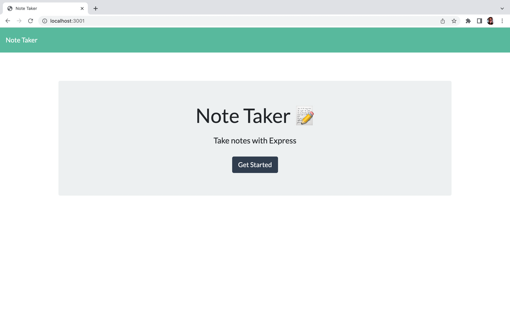
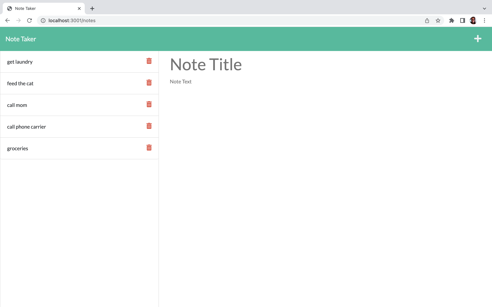
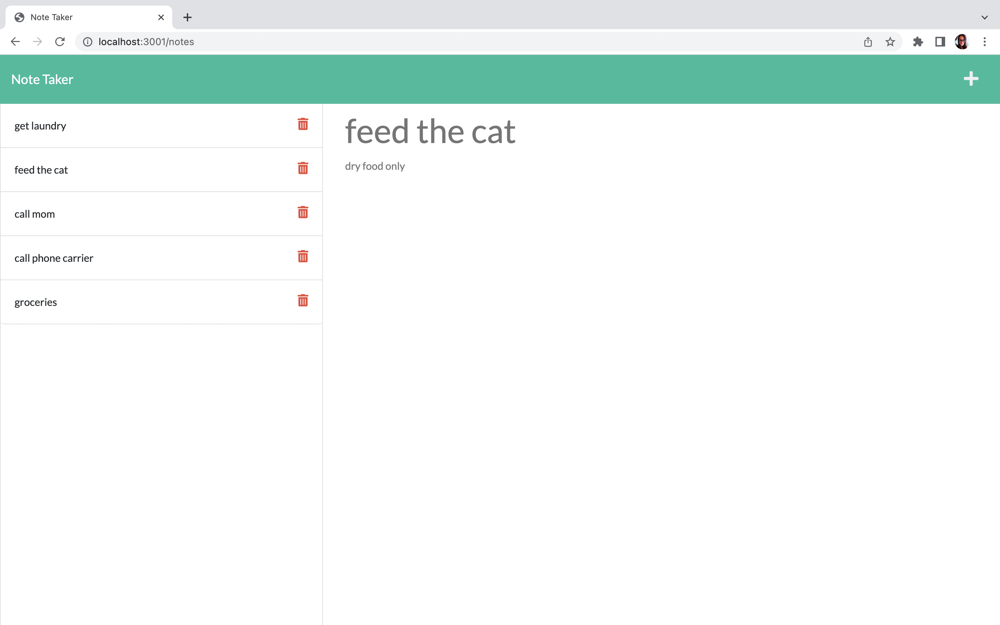
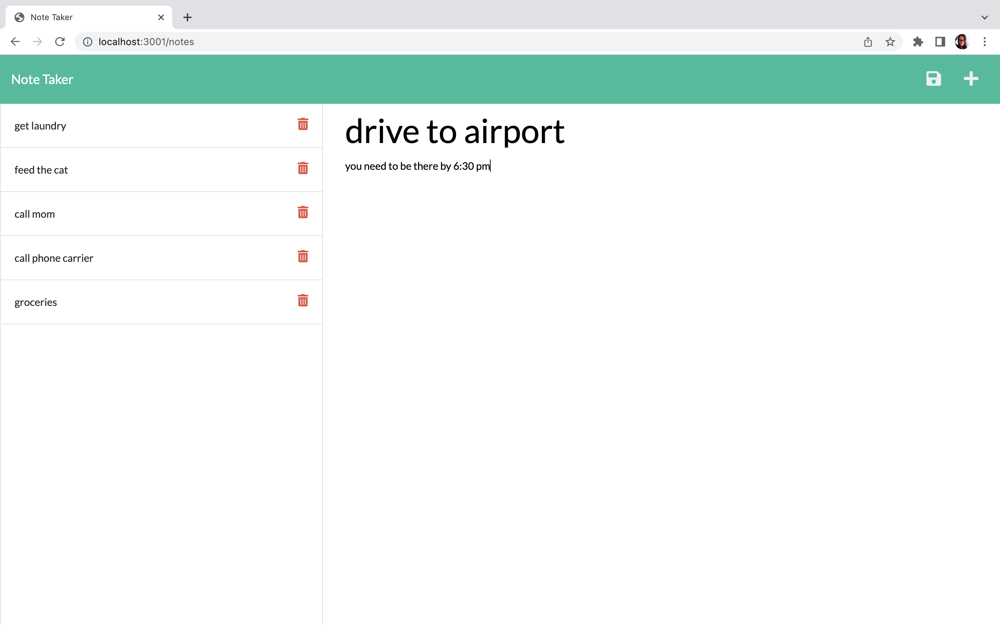
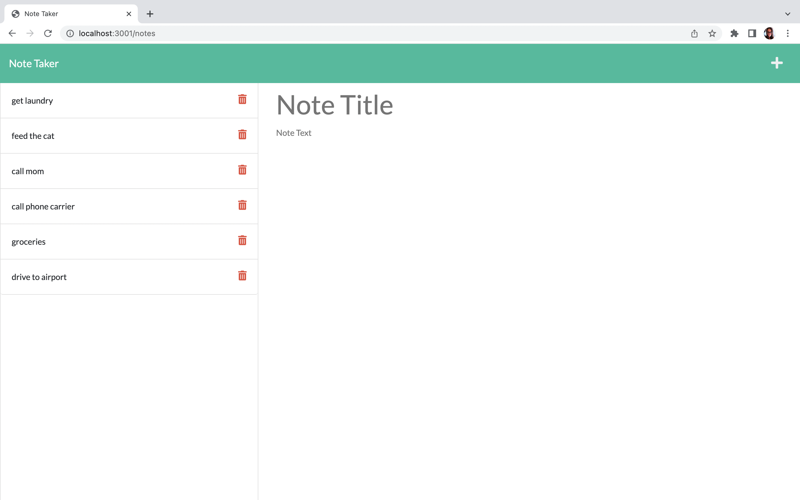
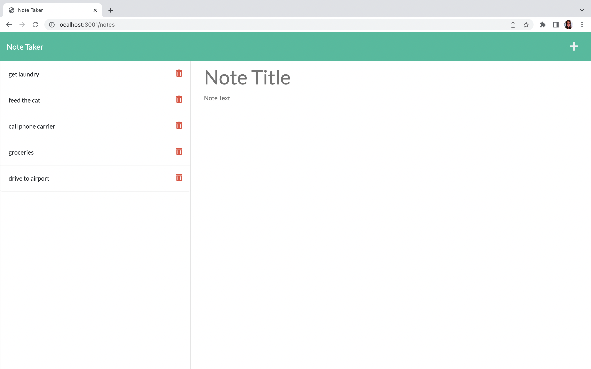

# note-taker

<h1> Note Taker </h1>

 This is a website to take, view and delete notes 

 
<h2>Table of Contents</h2>

<a href = "#info">1. Information</a> 
<a href = "#tech">2. Technologies</a> 
<a href = "#scr">3. Screenshots</a> 
<a href = "#qs">4. Questions</a> 

1. Information: When you open the website, you are presented with a home screen, once you click take notes, you can add a new note, or view or delete an existing note

2. Technologies used: 
<ul>
<li>HTML</li>
<li>CSS</li>
<li>JavaScript</li>
<li>Node.js</li>
<li>Express.js</li>
</ul>

3. Screenshots  
<h3>- Home screen</h3> 
  
<h3>- /notes shows existing notes and option to add a note</h3> 
  
<h3>- Viewing an existing note</h3> 
  
<h3>- Adding a new note (notice save icon appearing)</h3> 
  
<h3>- New note added to existing notes (notice left side panel)</h3> 
  
<h3>- Deleting note (Notice "call mom" note gone)</h3>  
  

4. Questions:  E-mail: vickybedewi-95@hotmail.com   
Github: <a href="https://github.com/elbedewi95">github.com/elbedewi95</a>

<h2>

